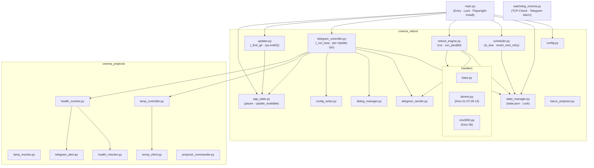
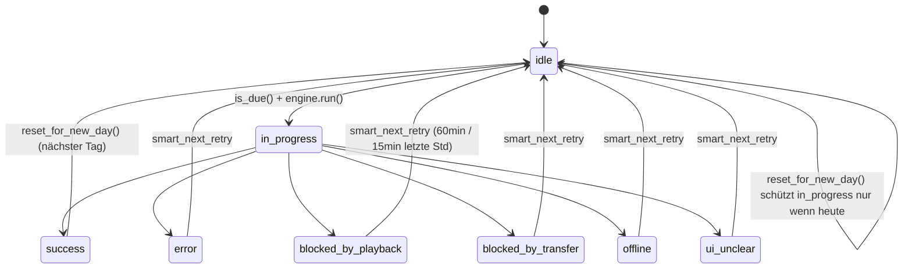
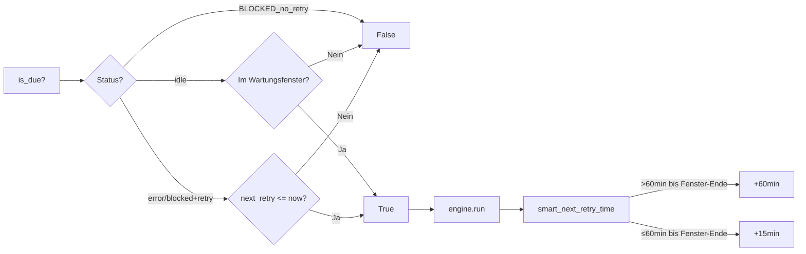
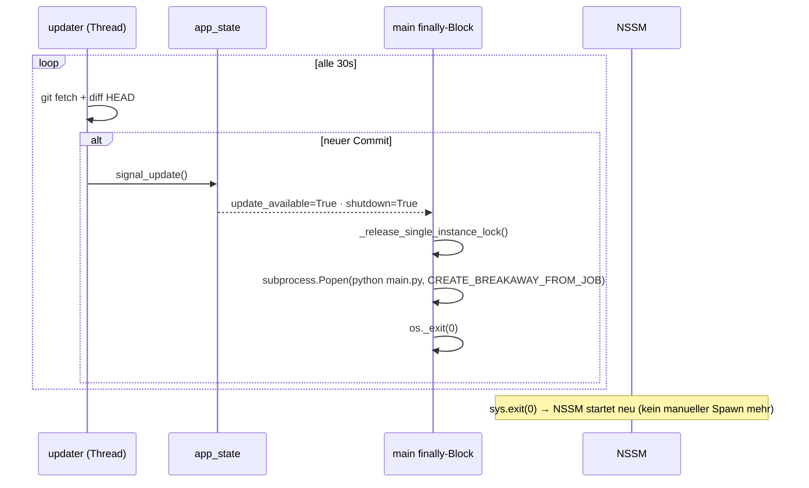

# GRAPH.md — Kompakte Wissensbasis (token-effizient)

## Nutzer

```
Shervin · Kino-IT · Python (kein Anfänger) · Windows 10 · NSSM-Dienst
Plan vor Aktion → Freigabe abwarten · Direkt & knapp · Deutsch
Produktiv auf echten Kino-Servern (13 Stück, Doremi/GDC)
Telegram-Bot = primäre UI · kein Web-UI · kein Test-Framework (–dry-run)
```

## System-Architektur



## State-Lifecycle (pro Kino)



## Scheduler-Logik



## Auto-Updater (vereinfacht nach Versuch 6)



## Telegram-Dialog-Systeme

```
_lamp_dlg  : dict[chat_id → state]   → Lampe/Health/Programm
_dm        : DialogManager (global)   → Reboot-Untermenüs
Cancel/Reset: immer BEIDE zurücksetzen → _ld_reset(chat_id) + _dm.reset()
```

## Einzelinstanz-Lock

```
Port 47392 TCP bind auf 127.0.0.1
Vor os.execv() / Popen+exit: _release_single_instance_lock()
Doppelinstanz-Root-Cause: ungeklärt (VBS → 2× Python beim ersten Start)
Ausgeschlossen: Autostart-Ordner, Task Scheduler, VBS-Inhalt
Nächster Debug-Schritt: Sysinternals Process Monitor
```

## Bug-Historie (alle behoben)

| # | Datei | Problem | Fix |
|---|-------|---------|-----|
| 1 | state_manager.py | reset_for_new_day() setzte in_progress anderer Tage nie zurück | `last_attempt_at[:10] == today` |
| 2 | telegram_controller.py | Exception-Handler per-Batch → ganzer Batch fiel aus | per-Update in for-Schleife |
| 3 | lamp_controller.py | Cancel rief nur _ld_reset(), nicht _dm.reset() | `self._dm.reset()` ergänzt |
| 4 | scheduler.py | BLOCKED ohne Retry → is_due() gab jede Minute True | explizite False-Rückgabe |
| 5 | updater.py | git nicht im PATH (NSSM als SYSTEM) | `_find_git()` sucht explizit |
| 6 | main.py | Playwright-Binary fehlte für SYSTEM-Dienst | Auto-Install beim Start |
| 7 | main.py | os.execv() → 2 Instanzen | Popen+CREATE_BREAKAWAY+os._exit(0) |
| 8 | watchdog_cinema.py | bind() auf 47392 → Port-Konflikt | connect() statt bind() |
| 9 | lamp_config.py | pending-Kinos mit projector_ip wurden trotzdem in SNMP+Health-Monitor aufgenommen | `c.get("type") != "pending"` Filter |
| 10 | config.py + lamp_config.py | type=pending in config.yaml erforderte manuelle User-Aktion | `cinema_overrides.yaml` + `_apply_overrides()` |

## cinema_overrides.yaml — Deployment ohne config.yaml-Änderung

```
Datei: cinema_overrides.yaml (committed, kein sensitiver Inhalt)
Mechanismus: Config._apply_overrides() + lamp_config._apply_overrides()
             → merged vor _validate() / projectors-Liste
             → config.yaml-Dicts werden in-place überschrieben
Aktuelle Einträge: kino06 + kino07 → type: "pending"
Neue Kinos: einfach weiteren Eintrag hinzufügen
```

## Regeln (kodifiziert)

```
state_manager : alle mutierenden Methoden mit self._lock
              : _save() nur mit gehaltenem Lock
              : _get_cinema() niemals außerhalb Lock
telegram      : Exception-Handler per-Update
cancel        : _ld_reset(chat_id) + _dm.reset()
updater       : _release_single_instance_lock() vor os.execv()/Popen
git           : config.yaml niemals committen
code          : keine WAS-Kommentare, nur WARUM wenn nicht offensichtlich
workflow      : Plan → Freigabe → Implementierung
```

## CLI-Befehle

```bash
python main.py                        # normal
python main.py --status               # kein Reboot
python main.py --run kino01           # Einzelkino sofort
python main.py --dry-run              # navigiert, kein echter Reboot
python main.py --test-projector kino01
python main.py --test-lamps
```

## Telegram-Befehle

```
1=Status · 2=/start=Menü · 3=Pause · 4=Resume · 5=Wartungsfenster
6=Server-Config · 7=Zugangsdaten · 8=Sofort-Reboot · 9=Scheduler-Reset · 10=Beenden
0=/abbrechen=Cancel
```

## Kino-Server-Typen

```
Doremi/DCP2000 : Kino 01–05, 09–13  → handlers/doremi.py
IMS3000        : Kino 08             → handlers/ims3000.py
pending        : Kino 06, 07         → kein Reboot, kein Lampen-/Health-Check
                                        gesetzt via cinema_overrides.yaml (kein config.yaml-Eingriff)
Barco          : optional            → barco_projector.py + snmp_client.py
```

## pending-Typ — Verhalten

```
config.yaml:   type: "pending"
Reboot:        nie (scheduler + engine bekommen kein pending-Kino)
Lampen-SNMP:   nie (lamp_config.py filtert type=pending aus projectors heraus)
Health-Monitor: nie (nutzt dieselbe projectors-Liste aus lamp_config.py)
Status (--status): sichtbar (config.cinemas enthält alle aktivierten Kinos)
State-Reset:   täglich wie alle anderen (config.cinemas)
Sofort-Reboot: blockiert (cmd_run_single + Telegram-Sofort-Reboot nutzen reboot_cinemas)
```
